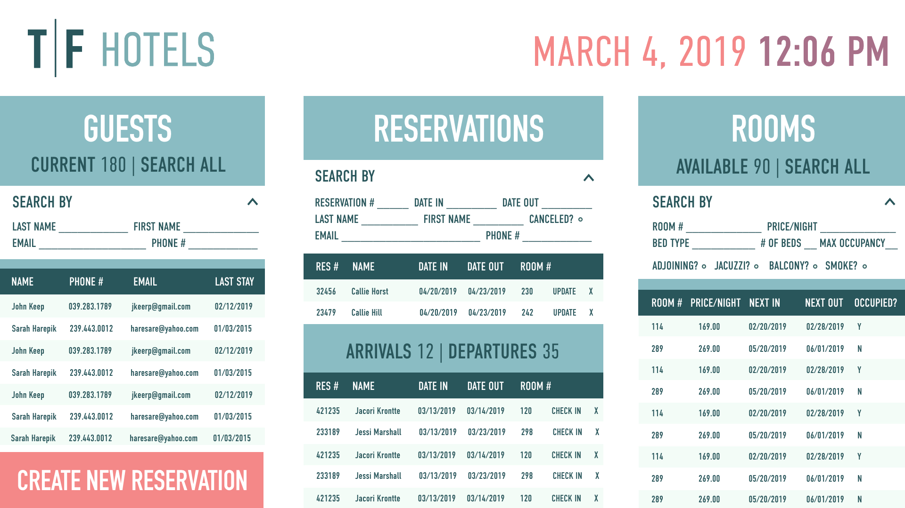
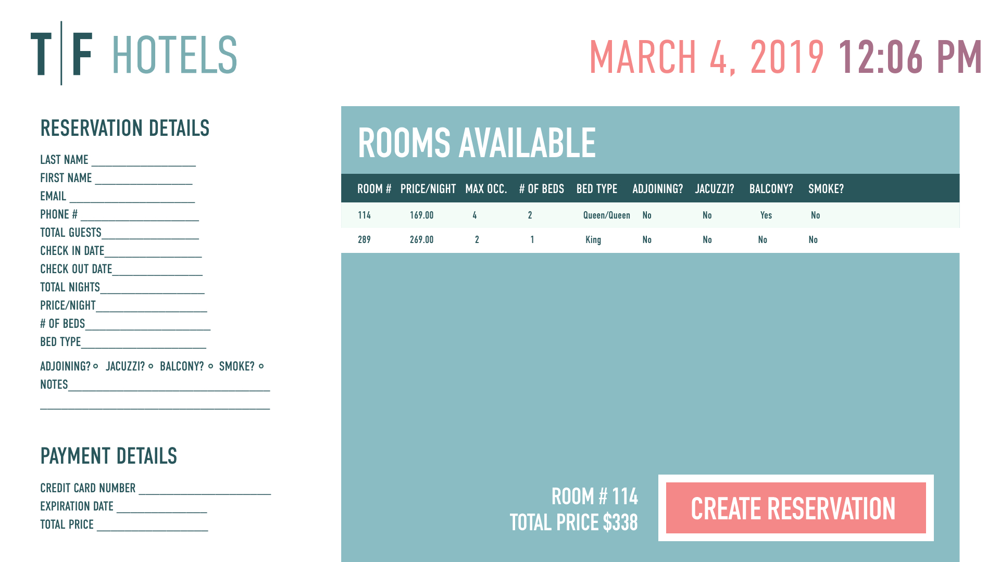

# <a href="https://tf-hotels.herokuapp.com/">T|F Hotel Management</a> App

**Concept**

A management system for front-desk employees that aggregates all relevant data and searches to one easy-to-use page, with creation of reservations and guest accounts just one page click away.

=======================================================================================

**Team**
- <a href="https://github.com/camille-the-eel">Camille Hughes</a>
- <a href="https://github.com/AriAlas"> Ariel Alas</a>

=======================================================================================

**Technologies Used**

- MySQL & Sequelize
- <a href="https://mockaroo.com/">Mockaroo</a> : for creating seed data
- Express
- Node
- Javascript
- <a href="https://ejs.co/">EJS Templating</a>
- <a href="https://momentjs.com/">Moment</a> : for handling dates and times
- <a href="https://express-validator.github.io/docs/">Express-Validator</a> : to validate data before pushing into the database
- <a href="https://bulma.io/">Bulma CSS Framework</a>
- HTML

=======================================================================================

**Build Status: In Development**

Current Features:
- search guests
    - filter: currently in house or all
    - additional filters: by first name, last name, phone number
- search reservations
    - filter: by reservation number, date in, date out
    - filter: by first name, last name, phone number
    - filter: canceled
- search rooms
    - filter: by room number, bed type, number of beds, max occupancy, minimum price, maximum price, additional features (adjoining, jacuzzi, balcony, smoke)
- displays all arrivals and departures scheduled for today
- check-in and check-out
- create new guest
- search for reservation availability by dates

Features to Come: 
- create new reservation according to specifications of guests
- search guests by email
- aggregate reservation search to a single form with all filters
- updating guest information
- calendar interface
- expanded guest profile/hotel membership
- room "clean" status/alerts
- credit card transactions
- authentication for employees vs admin

=======================================================================================

**Wireframes**

=======================================================================================

